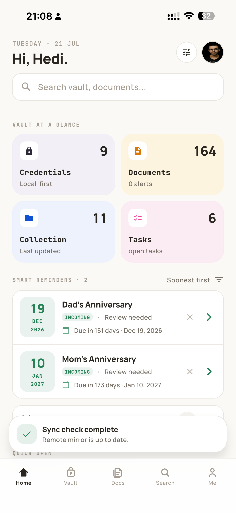
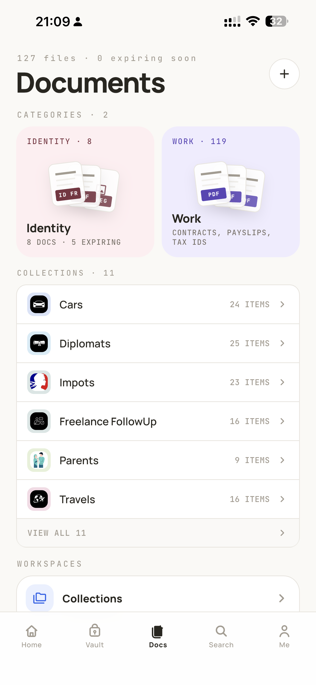
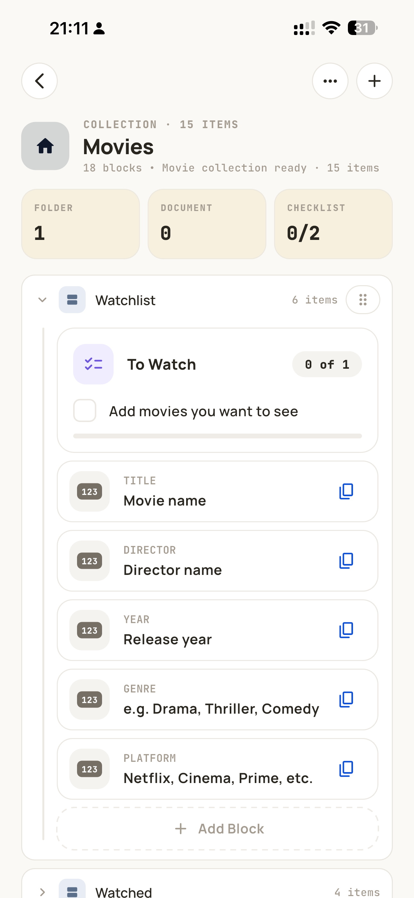
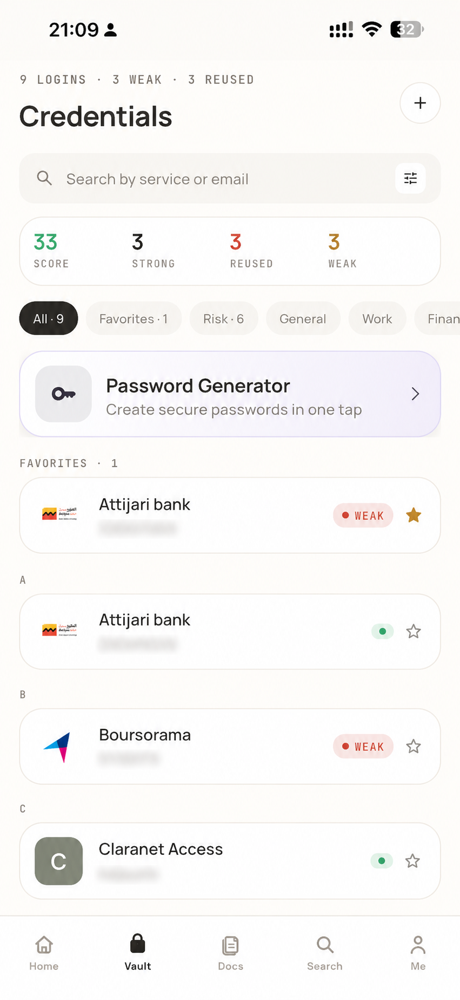
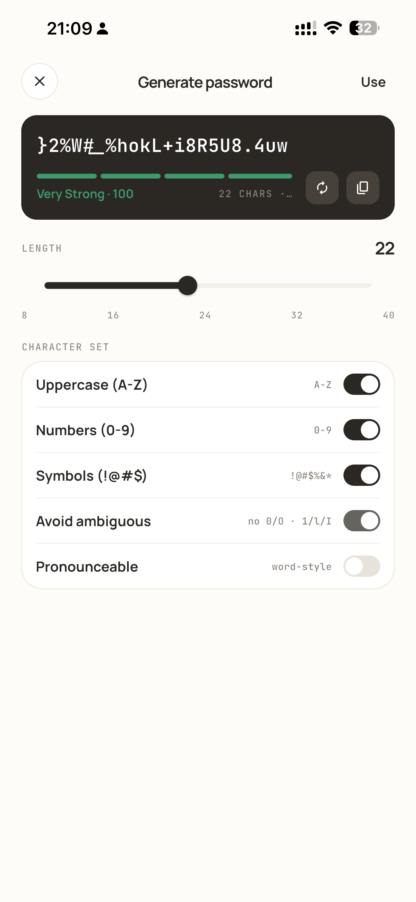
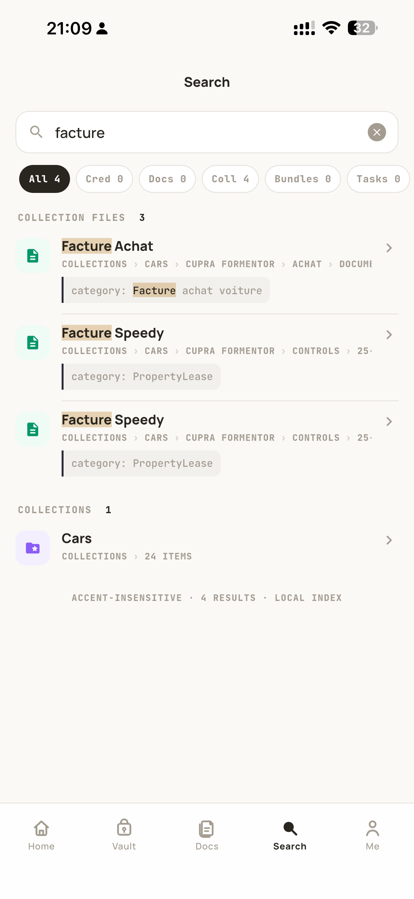
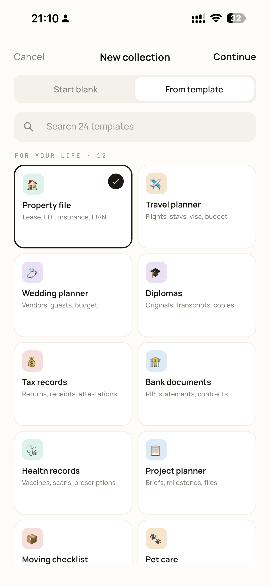
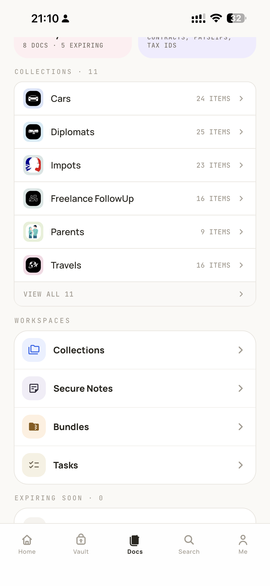
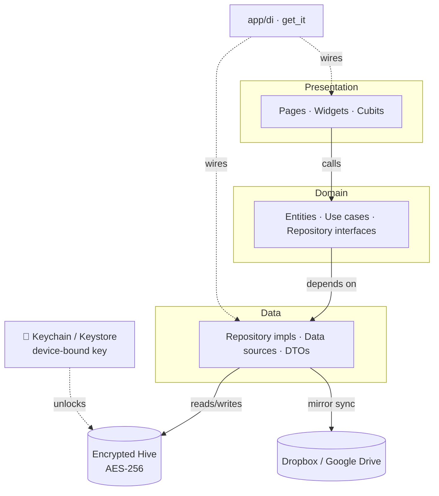

<div align="center">

# 🔐 Credence

### Your documents, credentials, and identity — encrypted, offline-first, and yours.

A local-first vault for passwords, passports, ID cards, credentials, and secure notes.
Everything is encrypted on your device; nothing lives on a server you don't control.


<!--  -->

[Screenshots](#-screenshots) · [Features](#-features) · [Security](#-security-model) · [Getting Started](#-getting-started) · [Architecture](#-architecture) · [Roadmap](#-roadmap) · [Contributing](#-contributing)

</div>

---

## ✨ Why Credence?

Most password managers ask you to trust a company's servers with your most sensitive data. Credence takes the opposite stance:

- **Local-first.** Your vault is an encrypted database on *your* device. The app works fully offline.
- **You own the keys.** Encryption keys never leave the device's secure hardware (Keychain / Keystore).
- **Bring your own cloud.** Optional backup/sync goes to *your* Dropbox or Google Drive — end-to-end encrypted, so the provider only ever sees ciphertext.
- **More than passwords.** Passports, ID cards, driving licences, credentials, secure notes, tasks, and rich document collections — one encrypted home for your whole "identity kit."

> [!NOTE]
> Credence is an independent, open-source project. It is not a licensed security product — see [Security disclosure](#-security-disclosure) before trusting it with irreplaceable data.

---

## 📱 Screenshots

<table>
  <tr>
    <td align="center"><br/><sub><b>Home — vault at a glance</b></sub></td>
    <td align="center"><br/><sub><b>Documents & identity</b></sub></td>
    <td align="center"><br/><sub><b>Block-based collections</b></sub></td>
    <td align="center"><br/><sub><b>Credential hygiene</b></sub></td>
  </tr>
  <tr>
    <td align="center"><br/><sub><b>Password generator</b></sub></td>
    <td align="center"><br/><sub><b>Local encrypted search</b></sub></td>
    <td align="center"><br/><sub><b>Collection templates</b></sub></td>
    <td align="center"><br/><sub><b>Workspaces</b></sub></td>
  </tr>
</table>

---

## 🚀 Features

| | |
|---|---|
| 🔑 **Credentials & generator** | Store logins and generate strong passwords (length, symbols, avoid-ambiguous, pronounceable word-style). One-tap copy **auto-clears the clipboard**, and a hygiene score flags weak/reused entries. |
| 🪪 **Identity documents** | Passports, ID cards, driving licences, travel & work papers — with **on-device OCR** (ML Kit) that auto-fills fields from a photo, plus expiry tracking. |
| 🗂️ **Collections** | Rich, **block-based** document sets (text, checklists, images, files, reminders, timelines, locations) with **24 ready-made templates** — property file, travel planner, tax records, diplomas, and more. |
| 📦 **Bundles** | Curate a **purpose-built packet** of vault items — a visa application, a rental file — then **export it as a self-contained archive** that no longer depends on the live vault. |
| 🔎 **Search** | One **local, offline, accent-insensitive** search across everything at once — credentials, documents, collection blocks, bundles, and tasks — with typed filters. |
| 📝 **Secure notes** | Encrypted **markdown notes** with a block editor — AES-256 at rest, like everything else in the vault. |
| ✅ **Tasks** | Task lists that live inside your vault and link to your documents and collections. |
| 🔗 **Secure share** | Share a credential or document via an **offline, passphrase-encrypted link** (Argon2id + AES-256-GCM) with a **tamper-proof expiry** baked into the payload — no server involved. |
| ☁️ **Backup & sync** | Encrypted backups + multi-device **mirror sync** to **your** Dropbox or Google Drive (OAuth PKCE, no client secret) — the provider only ever sees ciphertext. |
| 🩺 **Vault health** | Surfaces weak/duplicate passwords and an **expiry timeline** for documents about to lapse. |
| 🔔 **Reminders & widgets** | Local notifications for expiries and reminders, plus an **iOS home-screen widget** for documents expiring soon. |
| 📥 **Import** | Bulk-import existing data into the vault. |
| 🔒 **App lock** | **PIN (Argon2id-hashed) + biometric** unlock, auto-lock on background, and optional wipe after repeated failures. |
| 🖥️ **Everywhere** | One codebase across **iOS, Android, macOS, Windows, Linux, and Web**, with desktop-adapted navigation. |

---

## 🛡️ Security model

Credence is a vault, so security is a first-class feature — and we're honest about exactly what is (and isn't) protected.

| Layer | Mechanism |
|---|---|
| **Data at rest** | Every local record lives in a Hive box encrypted with **AES-256** (`HiveAesCipher`). |
| **Master key** | A 32-byte random key generated with a CSPRNG, stored in the platform Keychain/Keystore as **`first_unlock_this_device`** (never synced to iCloud, never leaves the device). Zeroed from memory when the app backgrounds. |
| **Backups & share links** | **AES-256-GCM** with keys derived via **Argon2id** (19 MB, 3 iterations — OWASP baseline), run on a worker isolate. Random per-payload salt + nonce. |
| **App lock** | PIN hashed with **Argon2id + a random salt**; biometric unlock via the platform (`local_auth`) with brute-force lockout. |
| **Share expiry** | Expiry is embedded **inside** the authenticated payload, so it can't be edited without breaking the GCM tag — links self-expire and can't be forged. |
| **Cloud OAuth** | Dropbox uses **PKCE (S256)** with no embedded client secret. No third-party analytics; no secrets committed to the repo. |

### Threat model — the honest version

Credence protects your data against **device loss/theft and at-rest disk extraction**: without unlocking the device, the vault is ciphertext. It is **not** designed to defend against a compromised OS, a jailbroken/rooted device with the screen unlocked, or malware running as you. Backup passphrases are stored on-device (to support future auto-backup), so treat a rooted device as game over. Found a real issue? See [Security disclosure](#-security-disclosure).

---

## 🏗️ Architecture

Credence follows a pragmatic **Clean Architecture**: presentation → domain → data, with dependency injection at the composition root and `flutter_bloc` cubits for state.



<details>
<summary><b>Project structure</b></summary>

```
lib/
├── app/            # Composition root: DI, theme, platform glue, app shell
├── core/           # Shared utils, config, constants
├── data/           # Repository impls, data sources, DTOs, encrypted storage
├── domain/         # Entities, use cases, repository interfaces
├── features/       # 19 feature modules (auth, backup, collections, credentials,
│                   #   documents, generator, notes, secure_share, vault_sync, …)
│                   #   each: presentation/ (+ its own data/domain where local)
└── l10n/           # Localizations (EN / FR)

test/
├── support/        # Hive test harness (fakes path_provider + secure_storage)
├── data/ · features/  # Unit tests (crypto, sync merge, replay engine, …)
```
</details>

**Architecture guardrails** (please keep these):
- Don't pass repositories/use-cases through deep UI widget constructors.
- Presentation widgets receive simple callbacks + view models already prepared by a cubit/parent.
- Keep dependency wiring in composition roots (`app/di`, page containers, or cubits), never in leaf widgets.

---

## 🧰 Tech stack

**Flutter** · **Dart** · `flutter_bloc` (state) · `get_it` (DI) · `hive` (encrypted local store) · `cryptography` (AES-GCM / Argon2id) · `flutter_secure_storage` (Keychain/Keystore) · `local_auth` (biometrics) · `dio` + `retrofit` (HTTP) · `google_mlkit_text_recognition` (OCR) · `pdfrx` (PDF) · `flutter_local_notifications` (expiry reminders).

---

## 🏁 Getting Started

### Prerequisites
- [Flutter](https://docs.flutter.dev/get-started/install) **3.44+** (Dart 3.9+)
- Xcode (iOS/macOS) and/or Android Studio for device builds

### Setup

```bash
git clone https://github.com/credentics/credence.git
cd credence
flutter pub get
```

Credence reads cloud/OAuth configuration from a `.env` file via `--dart-define-from-file`. Create one (keys are optional — features that lack config disable gracefully):

```bash
# .env
DROPBOX_APP_KEY=your_dropbox_app_key
GOOGLE_DRIVE_CLIENT_ID=your_google_client_id
BRANDFETCH_CLIENT_ID=your_brandfetch_client_id   # optional: credential logos
```

### Run

The included **Makefile** wraps the common flows:

```bash
make run           # debug on the default device
make run-ios       # iOS simulator
make run-macos     # macOS desktop
make run-chrome    # web
make test          # run the test suite
make analyze       # static analysis
make help          # list every target
```

> [!WARNING]
> On a physical iPhone, **only** use `make release`. Do not use `flutter install` or `devicectl` install paths — an install-only fallback can wipe the local app container and your on-device vault. See [`AGENTS.md`](AGENTS.md).

---

## 🧪 Testing & CI

```bash
flutter test          # unit tests
dart analyze          # 0 warnings / 0 errors is the gate
```

Every push and PR runs **analyze + test** via [GitHub Actions](.github/workflows/ci.yml). A reusable **Hive test harness** (`test/support/`) fakes `path_provider` + `flutter_secure_storage` so code using real encrypted boxes can be tested headlessly — including the guarantee that a corrupt backup **aborts a restore before any data is wiped**.

---

## 🗺️ Roadmap

Credence is actively hardening toward a rock-solid 1.0. Honest status:

- [x] Encrypted-at-rest local vault, PIN + biometrics
- [x] Argon2id-backed backups & secure-share crypto
- [x] Non-destructive restore (validate → stage → rollback)
- [x] CI gate + growing test coverage
- [ ] **Auto-backup** — currently manual; the pipeline is being streamed/isolate-offloaded before re-enabling
- [ ] **Cross-device deletion propagation** (tombstones) — receiving side done; emission + 2-device validation in progress
- [ ] Atomic remote-write guarantees for concurrent multi-device sync
- [ ] Decompose remaining large presentation classes

---

## 🤝 Contributing

Contributions are welcome! Please:
1. Open an issue to discuss substantial changes first.
2. Keep the [architecture guardrails](#-architecture) intact.
3. Run `make analyze && make test` — the CI gate must stay green.
4. Write tests for logic changes (the `test/support` harness makes storage-backed tests easy).

---

## 🔐 Security disclosure

Credence handles highly sensitive data and is offered **as-is, without warranty**. If you discover a vulnerability, please **do not** open a public issue — email the maintainer privately so it can be fixed before disclosure. Independent security review is very welcome.

---

## 📄 License

Released under the **MIT License** — see [`LICENSE`](LICENSE).

> ⚠️ **Action required before publishing:** this repo does not yet contain a `LICENSE` file. Add one (MIT is assumed above) or update this section to match your chosen license.

---

<div align="center">
Built with Flutter · Made for people who'd rather hold their own keys.
</div>
